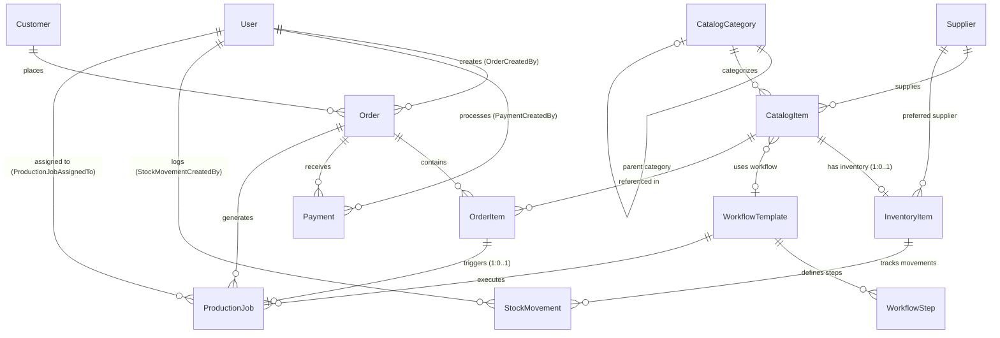

# StudioOS Entity Relationship Diagram (ERD)

This document describes the relational structure of the **StudioOS** core domain model in PostgreSQL.

## Mermaid ERD Diagram

## Entity Descriptions & Key Relationships

### 1. Catalog & Products/Services
- **CatalogItem**: Root entity representing either a `PHYSICAL_PRODUCT` or a `SERVICE`.
  - Belongs to optional `CatalogCategory`.
  - Has optional `WorkflowTemplate` (primarily for Services).
  - Linked to optional `Supplier`.
  - Has optional 1:1 `InventoryItem` (primarily for Physical Products).
  - Referenced in `OrderItem`.
- **CatalogCategory**: Hierarchical self-referencing entity for organizing catalog items.
- **Supplier**: Vendors supplying products or materials.

### 2. Inventory Management
- **InventoryItem**: Tracks stock on hand, reorder points, and physical locations for a `CatalogItem`.
- **StockMovement**: Audit trail of stock level changes (`IN`, `OUT`, `ADJUSTMENT`).

### 3. Workflow & Production
- **WorkflowTemplate**: Configurable sequence of production steps (e.g. Passport Photo: Photography -> Editing -> Printing -> Ready).
- **WorkflowStep**: Individual step in a template specifying order and estimated completion time.
- **ProductionJob**: Actual job created when a service or product requires production. Linked to `Order` and `OrderItem`.

### 4. Sales & POS (Orders & Payments)
- **Customer**: Studio client placing orders. Uses human-readable customer number (`CUS-2026-000001`).
- **Order**: Central transactional entity containing order items, totals, payments, and status (`ORD-2026-000001`).
- **OrderItem**: Line items representing purchased catalog items, quantities, and unit prices.
- **Payment**: Payment receipts issued for an order (`RCP-2026-000001`).

### 5. Identity & Security
- **User**: System user / employee managing orders, logging stock movements, processing payments, or working on production jobs.
- **AuditLog**: Comprehensive log of critical business events and security actions.
