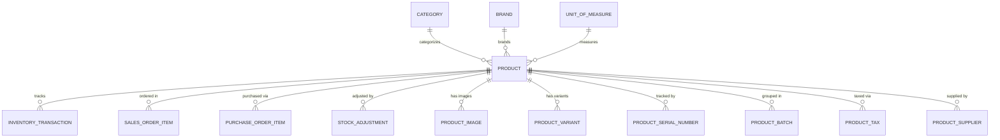

# StudioOS Product Domain Model

## 1. Executive Summary
The Product entity is the central hub of the StudioOS ERP system. It bridges operations across multiple departments, facilitating sales, purchasing, inventory, and manufacturing workflows. In the current StudioOS architecture, products are represented by the `CatalogItem` entity (where `itemType = PHYSICAL_PRODUCT`).

This document outlines the optimal domain design for the Product entity to ensure scalability and seamless integration with existing and future modules.

## 2. Entity Diagram

## 3. Core Identity
The product's identity ensures it can be uniquely identified and searched across the system rapidly.
- **SKU (Stock Keeping Unit):** A unique, alphanumeric identifier for internal tracking. It is mandatory and must be strictly unique.
- **Barcode:** A unique identifier (e.g., UPC, EAN) optimized for POS (Point of Sale) scanning and warehouse operations. It is optional but must be unique if provided.
- **Name:** The human-readable name of the product.
- **Description:** An optional text field providing detailed information about the product for internal reference, staff guidance, or customer-facing catalogs.

## 4. Relationships
To effectively organize and categorize products, they must maintain relationships with core domain entities:
- **Category (`categoryId`):** Enables hierarchical grouping of products (e.g., "Albums" -> "Leather Albums").
- **Brand (`brandId`):** Groups products by manufacturer or brand line.
- **Unit (`uomId`):** Defines the standard unit for quantifying the product (e.g., "Piece", "Box", "Meter"), ensuring accuracy in inventory counts and sales operations.

## 5. Pricing
Pricing fields dictate the financial metrics of the product.
- **Selling Price (`price`):** The standard retail price presented to customers.
- **Cost Price (`costPrice`):** The acquisition or manufacturing cost. Used to calculate margins, inventory valuation, and profit reporting.

## 6. Inventory Management
Inventory control settings dictate how the system handles stock logic:
- **Track Inventory (`trackInventory`):** A boolean flag indicating whether the system should maintain stock counts for this item.
- **Allow Negative Inventory (`allowNegativeStock`):** A boolean flag allowing the system to oversell a product or record a manufacturing consumption before stock is officially received.
- **Minimum Stock:** The lowest acceptable level of stock before a warning is triggered.
- **Maximum Stock:** Used for stock replenishment logic to prevent over-ordering.
- **Reorder Point:** The threshold that, when breached, triggers a low-stock alert or automated purchasing workflow.

## 7. Status & Audit
- **Status (`isActive`):** A boolean indicating if the product is currently available for use.
- **Audit:** `createdAt` and `updatedAt` timestamps, as well as `createdBy` and `updatedBy` fields for traceability.

## 8. Future Relationships & Dependencies Map
The Product entity will integrate with these future modules:
- **Inventory Transactions:** Real-time stock movements (IN, OUT, ADJUSTMENT).
- **Purchase Order Items:** Links Products to supplier orders to generate POs.
- **Sales Order Items:** Acts as the template for customer order lines.
- **Stock Adjustments:** Explicit records for inventory counts and corrections.
- **Product Images:** Multiple media assets for catalog and POS display.
- **Product Variants:** Extensions for handling attributes like Size or Color (e.g., T-Shirt -> Red/Large).
- **Product Serial Numbers:** High-value item tracking using unique serial codes per unit.
- **Product Batches:** Lot and batch tracking for perishable or manufactured goods.
- **Product Taxes:** Tax classifications and rates specific to the item.
- **Product Suppliers:** Many-to-many relationship linking a product to multiple vendors with vendor-specific SKUs and pricing.

## 9. Database Recommendations

### Recommended Indexes
- `@@index([sku])` (Unique constraint also acts as index, highly beneficial for rapid lookup).
- `@@index([barcode])` (For lightning-fast POS scans).
- `@@index([categoryId])` (For catalog browsing and reporting).
- `@@index([brandId])` (For brand-based filtering and analytics).
- `@@index([isActive])` (To quickly filter out discontinued items in lookups).

### Recommended Constraints
- `sku` must be `@unique`.
- `barcode` must be `@unique` (ignoring nulls).
- Enforce foreign key constraints with `onDelete: SetNull` or `onDelete: Restrict` for Category, Brand, and UoM to prevent breaking historical records.
- Price and Cost fields must be constrained to non-negative decimals.

## 10. Future Extension Strategy
- **Variants:** The base Product acts as a template, while `ProductVariant` handles permutations without cluttering the master list.
- **Bill of Materials (BOM) / Bundles:** A `ProductComponent` table will be introduced to handle manufactured goods or kits, deducting stock of individual components when the parent bundle is sold.
